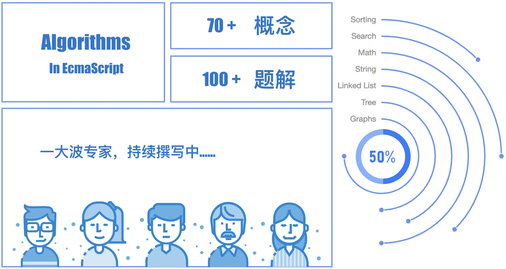

## 目录 Contents

### 经验方法 Methodology

| 序号 | **名称**                         | **En**   | 进度                                          |
| ---- | -------------------------------- | -------- | --------------------------------------------- |
| 1    | 用户：谁适合使用本教程？         | Who      |  |
| 2    | 目的：为什么要学习算法？         | Why      |  |
| 3    | 内容：算法基础需要掌握那些知识？ | What     |  |
| 4    | 环境：你需要准备什么样的环境？   | Where    |  |
| 5    | 计划：如何制定可持续的学习计划？ | When     |  |
| 6    | 方法：如何高效、牢固的掌握算法？ | How      |  |
| 7    | 付出：你需要付出什么？           | How Much |  |

### 排序 Sorting

> **100%** Statements `66/66` 	**100%** Branches `30/30`	**100%** Functions `6/6`	**100%** Lines `53/53`

| 序号 | 名称                                 | En             | 难度   | 进度                                          |
| ---- | ------------------------------------ | -------------- | ------ | --------------------------------------------- |
| 1    | [冒泡排序](./sorting/bubble-sort)    | Bubble sort    | `EASY` |  |
| 2    | [插入排序](./sorting/insertion-sort) | Insertion sort | `EASY` |  |
| 3    | [选择排序](./sorting/selection-sort) | Selection sort | `EASY` |  |
| 4    | [归并排序](./sorting/merge-sort)     | Merge sort     | `EASY` |  |
| 5    | [快速排序](./sorting/quick-sort)     | Quick sort     | `EASY` |  |
| 6    | [希尔排序](./sorting/shell-sort)     | Shell sort     | `EASY` |  |
| 7    | [排序总结](./sorting/README.md)      | Sorting        | `EASY` |  |

### 搜索 Search

> **100%** Statements `48/48` 	**100%** Branches `28/28`	**100%** Functions `4/4`	**100%** Lines `37/37`

| 序号 | 名称                               | En                   | 难度   | 进度                                          |
| ---- | ---------------------------------- | -------------------- | ------ | --------------------------------------------- |
| 1    | [线性搜索](./search/linear-search) | Linear Search        | `EASY` |  |
| 2    | [跳转搜索](./search/jump-search)   | Jump Search          | `EASY` |  |
| 3    | [二分查找](./search/binary-search) | Binary Search        | `EASY` |  |
| 4    | [差值搜索](./interpolation-search) | Interpolation Search | `EASY` |  |

### 链表 Linked List

> **100%** Statements `141/141` 	**100%** Branches `51/51`	**100%** Functions `17/17`	**100%** Lines `131/131`

| 序号 | 名称                                   | En              | 难度   | 进度                                          |
| ---- | -------------------------------------- | --------------- | ------ | --------------------------------------------- |
| 1    | 链表基础                               | Linked List     | `EASY` |  |
| 2    | [中间结点](./linked-list/middle)       | Middle          | `EASY` |  |
| 3    | [交换](./linked-list/swap)             | Swap            | `EASY` |  |
| 4    | [环检测](./linked-list/cycle-test)     | Cycle Test      | `EASY` |  |
| 5    | [环起点](./linked-list/cycle-begins)   | Cycle Begins    | `EASY` |  |
| 6    | [移除](./linked-list/remove)           | Remove          | `EASY` |  |
| 7    | [翻转](./linked-list/reverse)          | Reverse         | `EASY` |  |
| 8    | [局部翻转](./linked-list/reverse-part) | Partial Reverse | `EASY` |  |

### 二叉树 Binary Tree

> **100%** Statements `191/191` 	**100%** Branches `97/97`	**100%** Functions `19/19`	**100%** Lines `165/165`

| 序号 | 名称                                               | En                       | 难度   | 进度 |
| ---- | -------------------------------------------------- | ------------------------ | ------ | ---- |
| 1    | 二叉树基础                                         | Binary Tree              | `EASY` |      |
| 2    | [前序遍历](./binary-tree/02-preorder-traversal)    | Preorder Traversal       | `EASY` |      |
| 3    | [中序遍历](./binary-tree/03-inorder-traversal)     | Inorder Traversal        | `EASY` |      |
| 4    | [后序遍历](./binary-tree/04-postorder-traversal)   | Postordr Traversal       | `EASY` |      |
| 5    | [层序遍历](./binary-tree/05-level-order-traversal) | Level Order Traversal    | `EASY` |      |
| 6    | [最大深度](./binary-tree/06-maximum-depth)         | Maximum Depth            | `EASY` |      |
| 7    | [最小深度](./binary-tree/07-minimum-depth)         | Minimum Depth            | `EASY` |      |
| 8    | [左视图](./binary-tree/08-left-side-view)          | Left Side View           | `EASY` |      |
| 9    | [右视图](./binary-tree/09-right-side-view)         | Right Side View          | `EASY` |      |
| 10   | [反转](./binary-tree/10-invert)                    | Invert                   | `EASY` |      |
| 11   | [二叉搜索树](./binary-tree/11-bst)                 | BST (Binary Search Tree) | `EASY` |      |
| 12   | [平衡二叉树](./binary-tree/12-height-balanced)     | Height Balanced          | `EASY` |      |

### 数学 Math

> **100%** Statements `94/94` 	**100%** Branches `36/36`	**100%** Functions `21/21`	**100%** Lines `70/70`

| 序号 | 名称                                         | En                      | 图解 | 进度                                          |
| ---- | -------------------------------------------- | ----------------------- | ---- | --------------------------------------------- |
| 1    | [阶乘](./math/factorial)                     | Factorial               |      |  |
| 2    | [斐波那契数](./math/fibonacci)               | Fibonacci               |      |  |
| 3    | [最大公约数](./math/greatest-common-divisor) | Greatest Common Divisor |      |  |
| 4    | [最小公倍数](./math/least-common-multiple)   | Least Common Multiple   |      |  |
| 5    | [素数检测](./math/primality-test)            | Primality Test          |      |  |
| 6    | [素数筛查](./math/primes-count)              | Primes Count            |      |  |
| 7    | [2 的幂](./math/power-of-two)                | Power Of Two            |      |  |
| 8    | [3 的幂](./math/power-of-three)              | Power Of Three          |      |  |

-------

> ⭐️ 点赞突破 **1000** 解锁全部内容

### 🔒 字符串 String

| 序号 | 名称               | En                          | 难度 | 进度                                          |
| ---- | ------------------ | --------------------------- | ---- | --------------------------------------------- |
| 1    | 回文               | Palindrome                  |      |  |
| 2    | 汉明距离           | Hamming Distance            |      |  |
| 3    | 来温斯坦距离       | Levenshtein distance        |      |  |
| 4    | KMP 算法           | KMP Algorithm               |      |  |
| 5    | 字符串快速查找算法 | Z Algorithm                 |      |  |
| 6    | Rabin Karp 算法    | Rabin Karp Algorithm        |      |  |
| 7    | 最长公共子串       | Longest Common Substring    |      |  |
| 8    | 正则表达式匹配     | Regular Expression Matching |      |  |

### 🔒 集合 Set

| 序号 | **名称**       | **En**                         | 难度 | 进度                                          |
| ---- | -------------- | ------------------------------ | ---- | --------------------------------------------- |
| 1    | 笛卡尔积       | Cartesian Product              |      |  |
| 2    | 洗牌算法       | Fisher–Yates Shuffle           |      |  |
| 3    | 幂集           | Power Set                      |      |  |
| 4    | 排列           | Permutations                   |      |  |
| 5    | 组合           | Combinations                   |      |  |
| 6    | 最长公共子序列 | Longest Common Subsequence     |      |  |
| 7    | 最长递增子序列 | Longest Increasing Subsequence |      |  |
| 8    | 最短公共父序列 | Shortest Common Supersequence  |      |  |
| 9    | 背包问题       | Knapsack Problem               |      |  |
| 10   | 最大子数列问题 | Maximum Subarray               |      |  |
| 11   | 组合求和       | Combination Sum                |      |  |

### 🔒 图 Graphs

| **序号** | **名称**             | **En**                    | **难度** | **进度**                                      |
| -------- | -------------------- | ------------------------- | -------- | --------------------------------------------- |
| 1        | 图基础               | Graph                     |          |  |
| 2        | 深度优先搜索         | Depth-First Search (DFS)  |          |  |
| 3        | 广度优先搜索         | Breadth-First Search(BFS) |          |  |
| 4        | 克鲁斯克尔演算法     | Kruskal's Algorithm       |          |  |
| 5        | 戴克斯特拉算法       | Dijkstra Algorithm        |          |  |
| 6        | 贝尔曼-福特算法      | Bellman-Ford Algorithm    |          |  |
| 7        | 弗洛伊德算法         | Floyd-Warshall Algorithm  |          |  |
| 8        | 判圈算法             | Detect Cycle              |          |  |
| 9        | 普林演算法           | Prim's Algorithm          |          |  |
| 10       | 拓扑排序             | Topological Sorting       |          |  |
| 11       | 关节点 - Tarjan 算法 | Articulation Points       |          |  |
| 12       | 桥 - 基于 DFS 的算法 | Bridges                   |          |  |

## Contribution

If you think that these can be improved in anyway, please do suggest.

* Open pull request with improvements
* Discuss ideas in issues. Tell us, what do you want to know

## License

