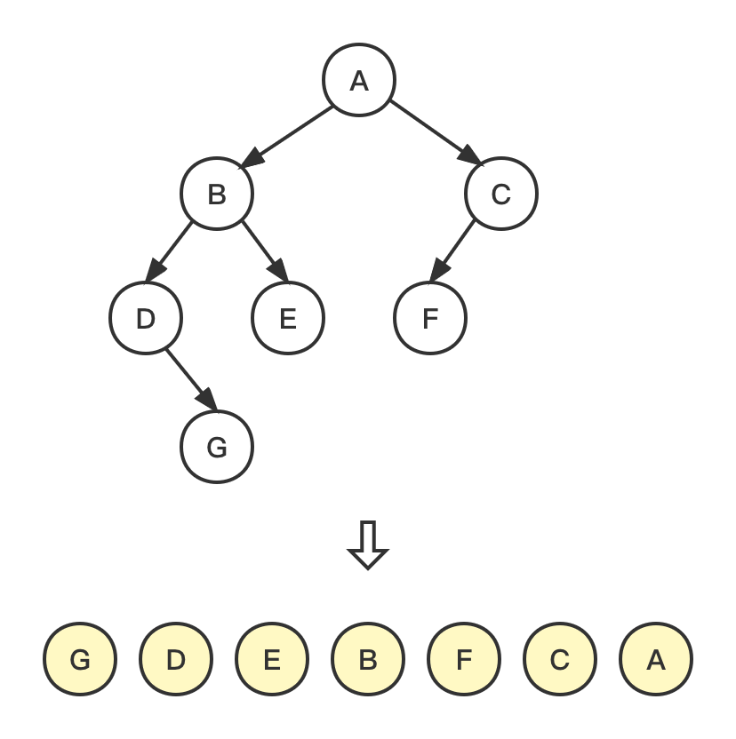
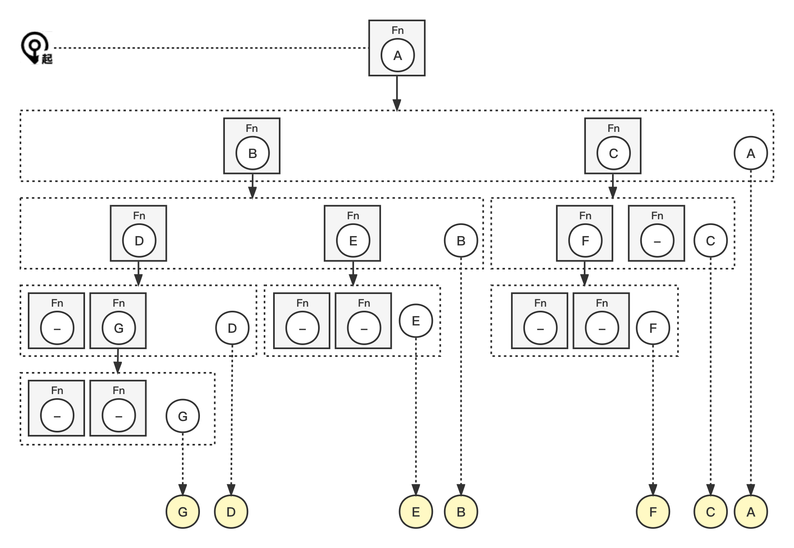
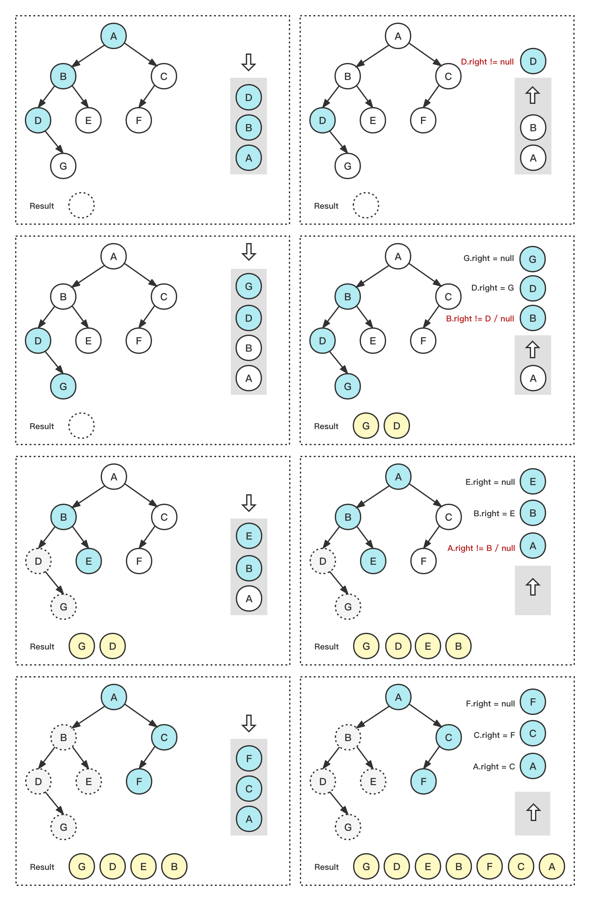

# 后序遍历 Postorder Traversal




## Problem

返回二叉树的后序遍历。

> Given the `root` of a binary tree, return *the postorder traversal of its nodes' values*.

Example:

``` bash
Input: root = [A,[B,C],[D,E,F,null],[null,G]]
Output: [G,D,E,B,F,C,A]
```

Example:

``` bash
Input: root = []
Output: []
```


## Solution


| 编号 | 解法       | Approach  |
| ---- | ---------- | --------- |
| 1    | 递归       | Recursion |
| 2    | 迭代       | Iteration |
| 3    | 莫里斯遍历 | Morris    |


### 1. 递归 Recursion

#### 图解流程



#### 代码示例

> recursion.js

``` js
const postorder = (root, arr = []) => {
  if (root) {
    postorder(root.left, arr);
    postorder(root.right, arr);
    arr.push(root.val);
  }
  return arr;
};
```

#### 复杂度分析

| 时间复杂度 | 空间复杂度 |
| ---------- | ---------- |
| O(n)       | O(n)       |

### 2. 迭代 Iteration

#### 图解流程



#### 代码示例

> iteration.js

``` js
const postorder = (root) => {
  const result = [];

  const stack = [];
  let prev;
  while (root || stack.length) {
    while (root) {
      stack.push(root);
      root = root.left;
    }
    root = stack.pop();
    if (!root.right || root.right === prev) {
      console.log(root.val, root.right ? root.right.val : '-', prev ? prev.val : '-');
      result.push(root.val);
      prev = root;
      root = null;
    } else {
      stack.push(root);
      root = root.right;
    }
  }

  return result;
};
```

#### 复杂度分析

| 时间复杂度 | 空间复杂度 |
| ---------- | ---------- |
| O(n)       | O(n)       |

### 3. 莫里斯遍历 Morris

#### 代码示例

``` js

```

#### 复杂度分析

| 时间复杂度 | 空间复杂度 |
| ---------- | ---------- |
| O(n)       | O(1)       |

