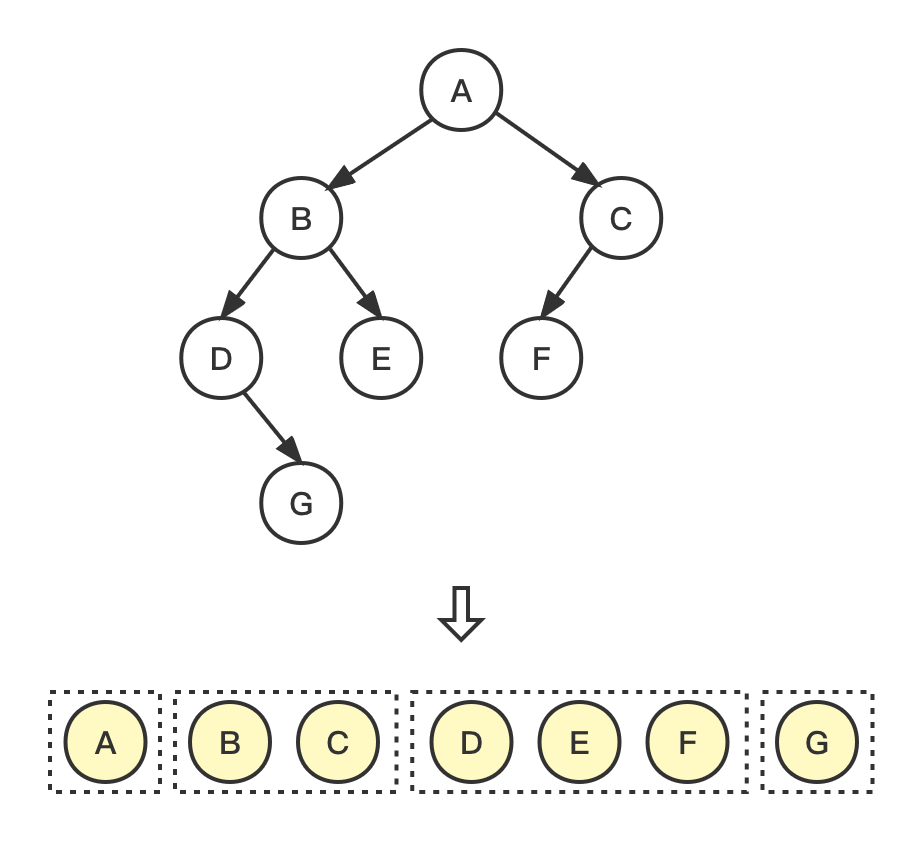
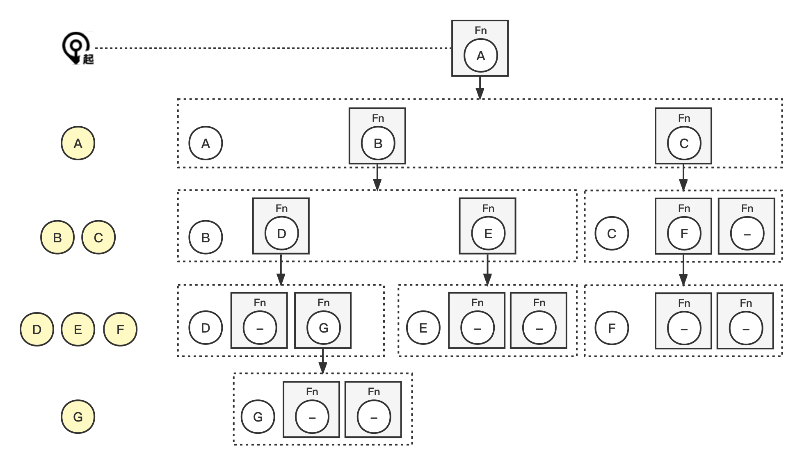
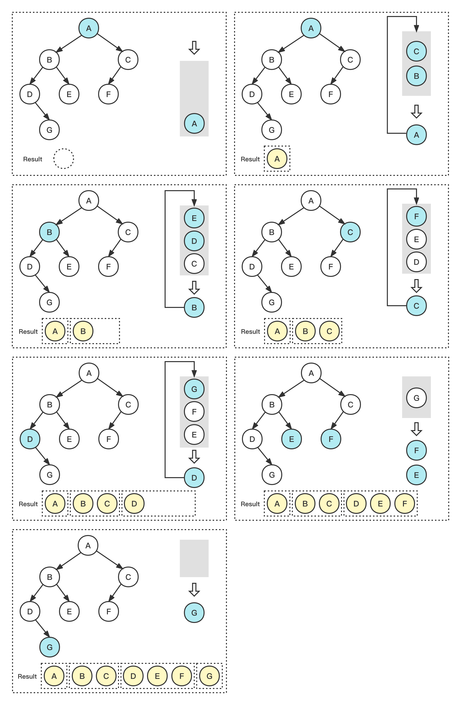

# 层序遍历 Level Order Traversal





## Problem

返回二叉树的层序遍历。

> Given the `root` of a binary tree, return *the level order traversal of its nodes' values*.

Example:

``` bash
Input: root = [A,[B,C],[D,E,F,null],[null,G]]
Output: [[A],[B,C],[D,E,F],[G]]
```

Example:

``` bash
Input: root = []
Output: []
```


## Solution

| 编号 | 解法 | Approach  |
| ---- | ---- | --------- |
| 1    | 递归 | Recursion |
| 2    | 迭代 | Iteration |

### 1. 递归 Recursion

#### 图解流程



#### 代码示例

> recursion.js

``` js
const levelOrder = (root, level = 0, arr = []) => {
  if (root) {
    if (!arr[level]) arr[level] = [];
    arr[level].push(root.val);
    levelOrder(root.left, level + 1, arr);
    levelOrder(root.right, level + 1, arr);
  }
  return arr;
};
```

#### 复杂度分析

| 时间复杂度 | 空间复杂度 |
| ---------- | ---------- |
| O(n)       | O(n)       |

### 2. 迭代 Iteration

#### 图解流程



#### 代码示例

> iteration.js

``` js
const levelOrder = (root) => {
  if (!root) return [];
  const queue = [root];
  const result = [];

  while (queue.length) {
    let len = queue.length;
    const arr = [];
    while (len) {
      const node = queue.shift();
      arr.push(node.val);
      if (node.left) queue.push(node.left);
      if (node.right) queue.push(node.right);
      len -= 1;
    }
    result.push(arr);
  }
  return result;
};
```

#### 复杂度分析

| 时间复杂度 | 空间复杂度 |
| ---------- | ---------- |
| O(n)       | O(n)       |

