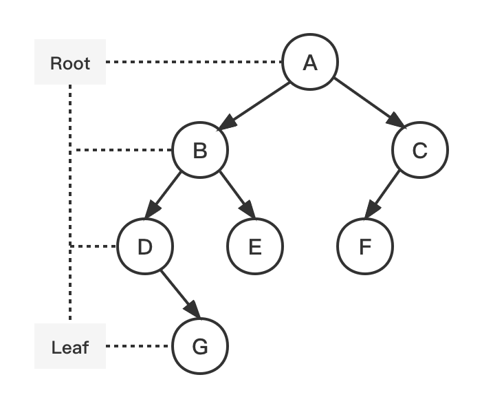

# 最大深度 Maximum Depth

二叉树的最大深度的定义：根节点到最远叶子节点的最长路径上的节点数。

> A binary tree's **maximum depth** is the number of nodes along the longest path from the root node down to the farthest leaf node.




## Problem

返回二叉树的最大深度。

> Given the `root` of a binary tree, return *its maximum depth*.

Example:

``` bash
Input: root = [A,[B,C],[D,E,F,null],[null,G]]
Output: 4
```

Example:

``` bash
Input: root = []
Output: 0
```

## Solution

| 编号 | 解法 | Approach  |
| ---- | ---- | --------- |
| 1    | 递归 | Recursion |
| 2    | 迭代 | Iteration |

### 1. 递归 Recursion

#### 图解流程

[暂无]

#### 代码示例

> recursion.js

``` js
const maximum = (root) => (root ? (Math.max(maximum(root.left), maximum(root.right)) + 1) : 0);
```

#### 复杂度分析

| 时间复杂度 | 空间复杂度 |
| ---------- | ---------- |
| O(n)       | O(n)       |

* 时间复杂度：O(n)，n 为二叉树节点的数量。每个节点仅被遍历一次。
* 空间复杂度：O(n)，n 为二叉树的高度。递归函数需要栈空间，而栈空间取决于递归的深度，等价于二叉树的高度。

### 2. 迭代 Iteration

#### 图解流程

[暂无]

#### 代码示例

> iteration.js

``` js
const maximum = (root) => {
  if (!root) return 0;
  const queue = [root];
  let level = 0;
  while (queue.length) {
    let { length } = queue;
    while (length) {
      root = queue.shift();
      if (root.left) queue.push(root.left);
      if (root.right) queue.push(root.right);
      length -= 1;
    }
    level += 1;
  }
  return level;
};
```

#### 复杂度分析

| 时间复杂度 | 空间复杂度 |
| ---------- | ---------- |
| O(n)       | O(n)       |

* 时间复杂度：O(n)，n 为二叉树节点的数量。每个节点仅被遍历一次。

* 空间复杂度：O(n)。空间的消耗取决于队列存储的元素数量，最坏下会达到 O(n)。