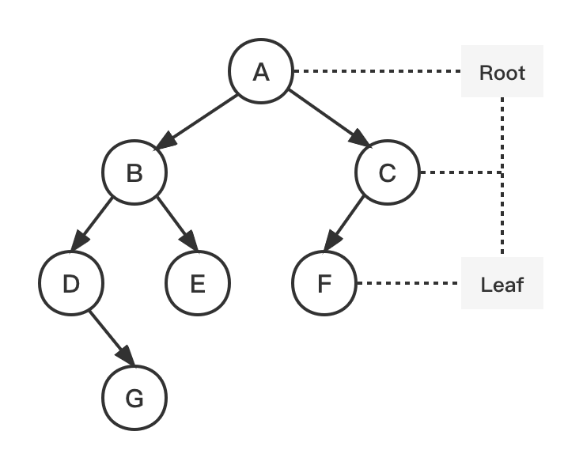

# 最小深度 Minimum Depth

二叉树的最小深度定义：从根节点到最近叶子节点的最短路径上的节点数量。

> The minimum depth is the number of nodes along the shortest path from the root node down to the nearest leaf node.




## Problem

返回二叉树的最小深度。

> Given a binary tree, find its minimum depth.

Example:

``` bash
Input: root = [A,[B,C],[D,E,F,null],[null,G]]
Output: 3
```

Example:

``` bash
Input: root = []
Output: 0
```


## Solution

| 编号 | 解法 | Approach  |
| ---- | ---- | --------- |
| 1    | 递归 | Recursion |
| 2    | 迭代 | Iteration |

### 1. 递归 Recursion

#### 图解流程

[暂无]

#### 代码示例

> recursion.js

``` js
const minimum = (root, min = Infinity) => {
  if (!root) return 0;
  if (!root.left && !root.right) return 1;
  if (root.left) {
    min = Math.min(minimum(root.left), min);
  }
  if (root.right) {
    min = Math.min(minimum(root.right), min);
  }
  return min + 1;
};
```

#### 复杂度分析

| 时间复杂度 | 空间复杂度 |
| ---------- | ---------- |
| O(n)       | O(n)       |

* 时间复杂度：O(n)，n 为二叉树节点的数量。每个节点仅被遍历一次。
* 空间复杂度：O(n)，n 为二叉树的高度。递归函数需要栈空间，而栈空间取决于递归的深度，等价于二叉树的高度。

### 2. 迭代 Iteration

#### 图解流程

[暂无]

#### 代码示例

> iteration.js

``` js
const minimum = (root) => {
  if (!root) return 0;
  const queue = [root];
  let level = 1;
  while (queue.length) {
    let { length } = queue;
    while (length) {
      const node = queue.shift();
      if (!node.left && !node.right) return level;
      if (node.left) queue.push(node.left);
      if (node.right) queue.push(node.right);
      length -= 1;
    }
    level += 1;
  }
  return level;
};
```

#### 复杂度分析

| 时间复杂度 | 空间复杂度 |
| ---------- | ---------- |
| O(n)       | O(n)       |

* 时间复杂度：O(n)，n 为二叉树节点的数量。每个节点仅被遍历一次。

* 空间复杂度：O(n)。空间的消耗取决于队列存储的元素数量，最坏下会达到 O(n)。


