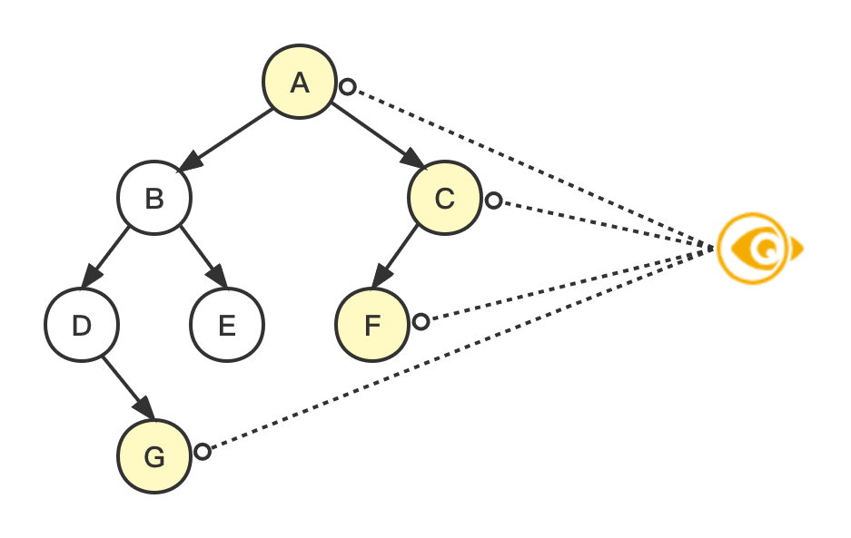

# 右视图 Right Side View




## Problem

> Given the `root` of a binary tree, imagine yourself standing on the **right side** of it, return *the values of the nodes you can see ordered from top to bottom*.

Example:

``` bash
Input: root = [A,[B,C],[D,E,F,null],[null,G]]
Output: [A,C,F,G]
```

Example:

``` bash
Input: root = []
Output: []
```


## Solution


| 编号 | 解法 | Approach  |
| ---- | ---- | --------- |
| 1    | 递归 | Recursion |
| 2    | 迭代 | Iteration |


### 1. 递归 Recursion

#### 图解流程

[暂无]

#### 代码示例

> recursion.js

``` js

```

#### 复杂度分析

| 时间复杂度 | 空间复杂度 |
| ---------- | ---------- |
| O(n)       | O(n)       |

### 2. 迭代 Iteration

#### 图解流程

[暂无]

#### 代码示例

> iteration.js

``` js
const view = (root) => {
  if (!root) return [];
  const queue = [root];
  const result = [];
  while (queue.length) {
    let { length } = queue;
    while (length) {
      const node = queue.shift();
      if (length === 1) result.push(node.val);
      if (node.left) queue.push(node.left);
      if (node.right) queue.push(node.right);
      length -= 1;
    }
  }
  return result;
};
```

#### 复杂度分析

| 时间复杂度 | 空间复杂度 |
| ---------- | ---------- |
| O(n)       | O(n)       |

