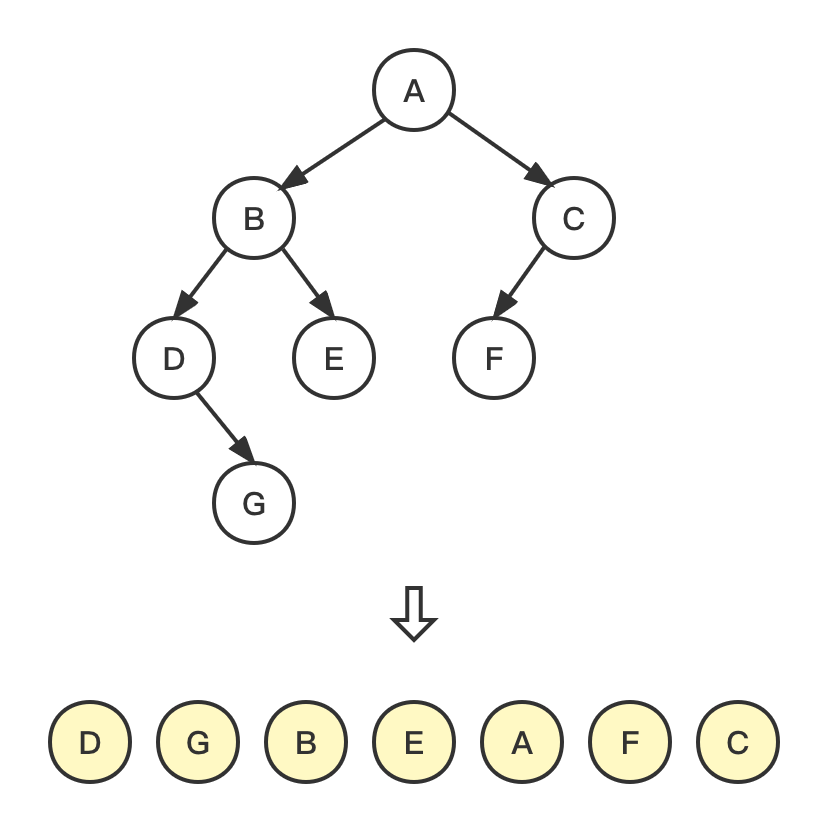
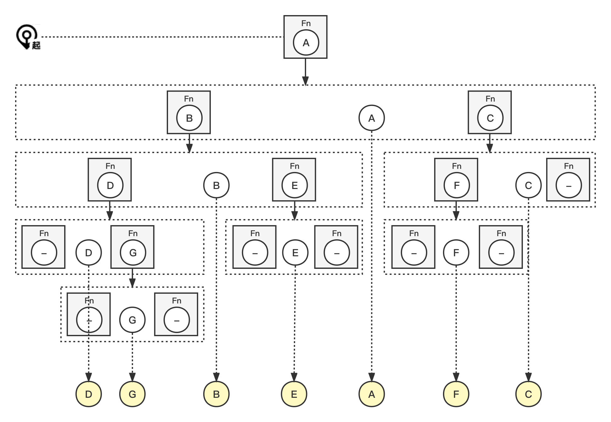
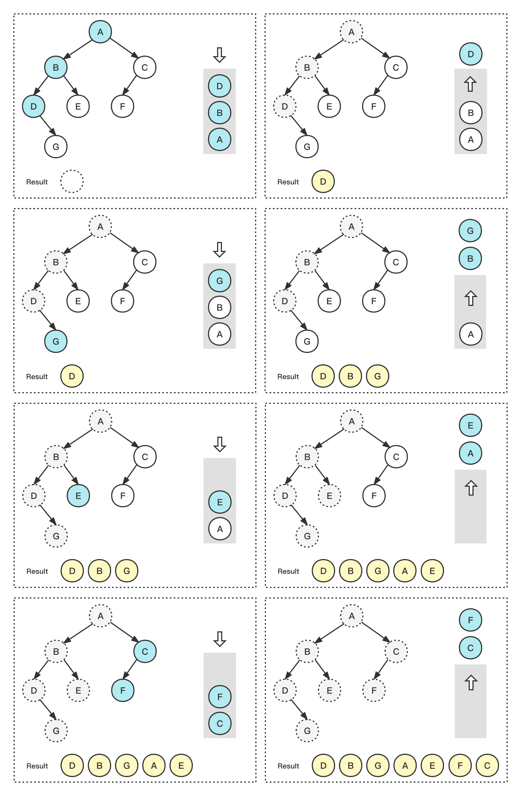

# 中序遍历 Inorder Traversal





## Solution


| 编号 | 解法       | Approach  |
| ---- | ---------- | --------- |
| 1    | 递归       | Recursion |
| 2    | 迭代       | Iteration |
| 3    | 莫里斯遍历 | Morris    |


### 1. 递归 Recursion



#### 代码示例

> recursion.js

``` js
const inorder = (root, arr = []) => {
  if (root) {
    inorder(root.left, arr);
    arr.push(root.val);
    inorder(root.right, arr);
  }
  return arr;
};
```

#### 复杂度分析

| 时间复杂度 | 空间复杂度 |
| ---------- | ---------- |
| O(n)       | O(n)       |

### 2. 迭代 Iteration



#### 代码示例

> iteration.js

``` js
const inorder = (root) => {
  const result = [];

  const stack = [];
  while (root || stack.length) {
    while (root) {
      stack.push(root);
      root = root.left;
    }
    root = stack.pop();
    result.push(root.val);
    root = root.right;
  }

  return result;
};
```

#### 复杂度分析

| 时间复杂度 | 空间复杂度 |
| ---------- | ---------- |
| O(n)       | O(n)       |

### 3. 莫里斯遍历 Morris

#### 代码示例

``` js

```

#### 复杂度分析

| 时间复杂度 | 空间复杂度 |
| ---------- | ---------- |
| O(n)       | O(1)       |

### 