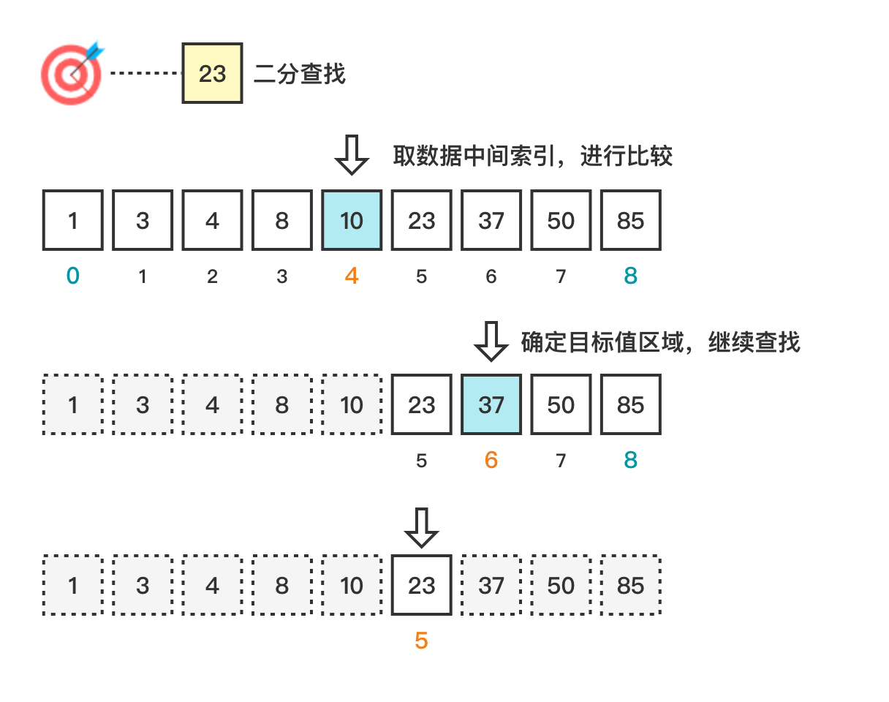

# 二分查找 (Binary Search)

二分查找 (Binary Search)，查找中间位置，并与中间位置元素进行比较，确定是搜索前面的区块还是后面的区块，重复这个过程，直到找到目标元素。

算法要求：

1. 顺序存储结构。
2. 关键字大小有序排列。例如、从小到大排列。

### 1. 图解流程



### 2. 代码示例

> binary-search.js

```js
const search = (arr = [], target = null) => {
  let start = 0;
  let end = arr.length - 1;
  while (start <= end) {
    const mid = Math.floor((end + start) / 2);
    if (arr[mid] === target) return mid;
    if (arr[mid] > target) end = mid - 1;
    else start = mid + 1;
  }
  return -1;
};
```

### 3. 复杂度分析

| 时间复杂度 | 空间复杂度 |
| ---------- | ---------- |
| O(log n)   | O(1)       |