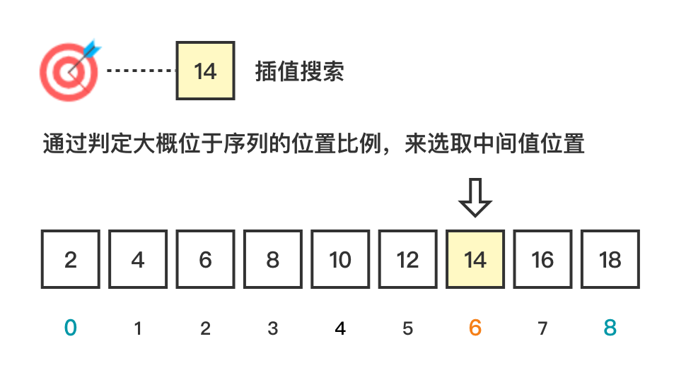

# 插值搜索 (Interpolation Search)

插值搜索 (Interpolation Search)，是二分查找的优化方案，通过判定大概位于序列的位置比例，来选取中间值位置。

算法要求：

1. 顺序存储结构。
2. 关键字大小有序排列。例如、从小到大排列。
3. 数据元素的关键字在查找表中均匀分布。这样，才可以按比例插值。


### 1. 图解流程




### 2. 代码示例

> interpolation-search.js

```js
const search = (arr = [], target = null) => {
  let start = 0;
  let end = arr.length - 1;
  while (start <= end) {
    const range = arr[end] - arr[start];
    const value = target - arr[start];

    if (value < 0) return -1;
    if (!range) return arr[start] === target ? start : -1;

    const mid = start + Math.floor((value * (end - start)) / range);
    if (arr[mid] === target) return mid;
    if (arr[mid] < target) start = mid + 1;
    else end = mid - 1;
  }
  return -1;
};
```

### 3. 复杂度分析

| 时间复杂度   | 空间复杂度 |
| ------------ | ---------- |
| O(log(logn)) | O(1)       |