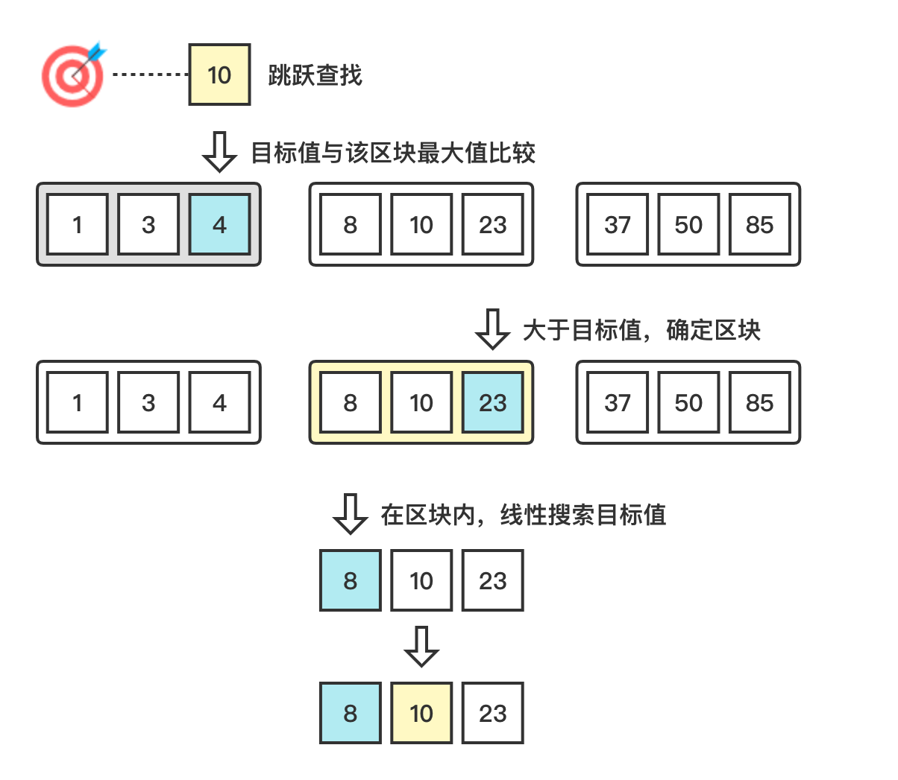

# 跳跃搜索 (Jump Search)

跳跃搜索 (Jump Search)，通过向前跳过固定个元素，找到目标值所在的区间，以便达到检查更少元素的目的。

算法要求：

1. 顺序存储结构。
2. 关键字大小有序排列。例如、从小到大排列。

### 1. 图解流程



### 2. 代码示例 

> jump-search.js

```js
const search = (arr = [], target = null) => {
  const size = Math.floor(Math.sqrt(arr.length));

  let start = 0;
  let end = size;

  while (target > arr[Math.min(end, arr.length) - 1]) {
    start = end;
    end += size;
    if (start > arr.length) return -1;
  }

  for (let i = 0; i < Math.min(end, arr.length); i += 1) {
    if (arr[i] === target) return i;
  }
  return -1;
};
```

### 3. 复杂度分析

| 时间复杂度 | 空间复杂度 |
| ---------- | ---------- |
| O(√n) | O(1)       |