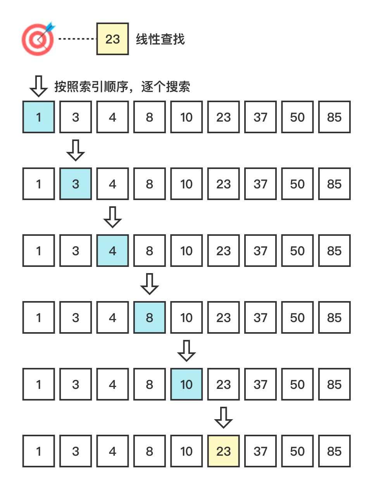

# 线性搜索 (Linear Search)

线性搜索 (Linear Search)，即按照数据的先后顺序，逐个搜索。

算法要求：

1. 顺序存储结构。

### 1. 图解流程



### 2. 代码示例 

> linear-search.js

```js
const search = (arr = [], target = null) => {
  for (let i = 0; i < arr.length; i += 1) {
    if (arr[i] === target) return i;
  }
  return -1;
};
```

### 3. 复杂度分析

| 时间复杂度 | 空间复杂度 |
| ---------- | ---------- |
| O(n)       | O(1)       |

