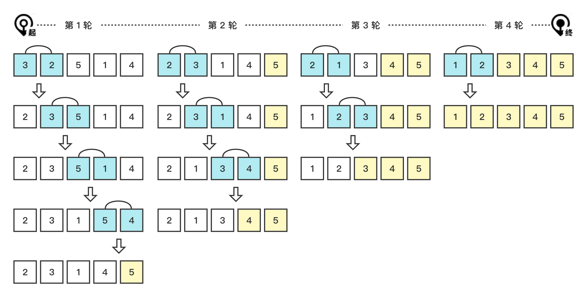

# 冒泡排序 (Bubble Sort)

冒泡排序 (Bubble Sort)，遍历数据并依次比较相邻的元素，按照升序或降序交换。每次遍历可以确定一个最大或最小的元素，则下次遍历不需要在比较这个元素。重复遍历直到确定所有元素位置。

优化要点：如果一次遍历中没有发生交换，则停止遍历。


### 1. 图解流程



### 2. 代码示例

> bubble-sort/index.js

 ``` js
function sort(arr = []) {
  const a = [...arr];
  let swapped = false;
  for (let i = 1; i < a.length; i += 1) {
    for (let j = 0; j < a.length - i; j += 1) {
      if (a[j] > a[j + 1]) {
        [a[j], a[j + 1]] = [a[j + 1], a[j]];
        swapped = true;
      }
    }
    if (!swapped) return a;
  }
  return a;
}
 ```

### 3. 复杂度分析

| 名称     | En          | 最优 | 平均 | 最坏 | 内存 | 稳定 |
| -------- | ----------- | ---- | ---- | ---- | ---- | ---- |
| 冒泡排序 | Bubble sort | n    | n^2  | n^2  | 1    | Yes  |

#### 3.1 时间复杂度 (Time Complexity)

设 C 表示比较次数，M 表示移动次数，最好情况：

$$
C_{min}=n-1
$$

$$
M_{min}=0
$$

时间复杂度为 $O(n)$。

最坏情况：

$$
C_{max}=\frac{n(n-1)}{2}=O(n^2)
$$

$$
M_{max}=\frac{3n(n-1)}{2}=O(n^2)
$$

时间复杂度为 $O(n^2)$。

平均时间复杂度为 $O(n^2)$。

#### 3.2 空间复杂度 (Space Complexity)

O(1)

#### 3.3 稳定性 (Stable)

由于两个元素相等不会被交换顺序，所以，冒泡排序是稳定排序。
