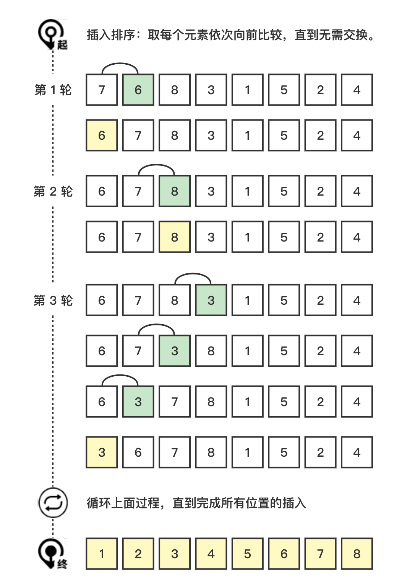

# 插入排序 (Insertion Sort)

插入排序 (Insertion Sort)，依次遍历所有元素，并将元素按升序或降序插入前面已经排序的元素中。

### 图解流程



### 代码示例

> insertion-sort/index.js

 ```js
function sort(arr = []) {
  const a = [...arr];
  for (let i = 1; i < a.length; i += 1) {
    for (let j = i; j > 0 && a[j] < a[j - 1]; j -= 1) {
      [a[j], a[j - 1]] = [a[j - 1], a[j]];
    }
  }
  return a;
}
 ```

### 复杂度分析

| 名称     | En             | 最优 | 平均 | 最坏 | 内存 | 稳定 |
| -------- | -------------- | ---- | ---- | ---- | ---- | ---- |
| 插入排序 | Insertion sort | n    | n^2  | n^2  | 1    | Yes  |

#### 时间复杂度 (Time Complexity)

使用 $C$ 表示比较次数，$M$ 表示移动次数。最好情况下：

$$
C_{min}=n-1
$$

$$
M_{min}=0
$$

此时时间复杂度为 $O(n)$。

最坏情况下 ：

$$
C_{max}=\frac{n(n-1)}{2}=O(n^2)
$$

$$
M_{max}=\frac{n(n-1)}{2}+(n-1)=O(n^2)
$$

此时时间复杂度为 $O(n^2)$。

平均时间复杂度为 $O(n^2)$。

#### 空间复杂度 (Space Complexity)

O(1)

#### 稳定性 (Stable)

对于相同的元素，后面的元素不会插入到前面的元素前面，所以，插入排序是稳定排序。
