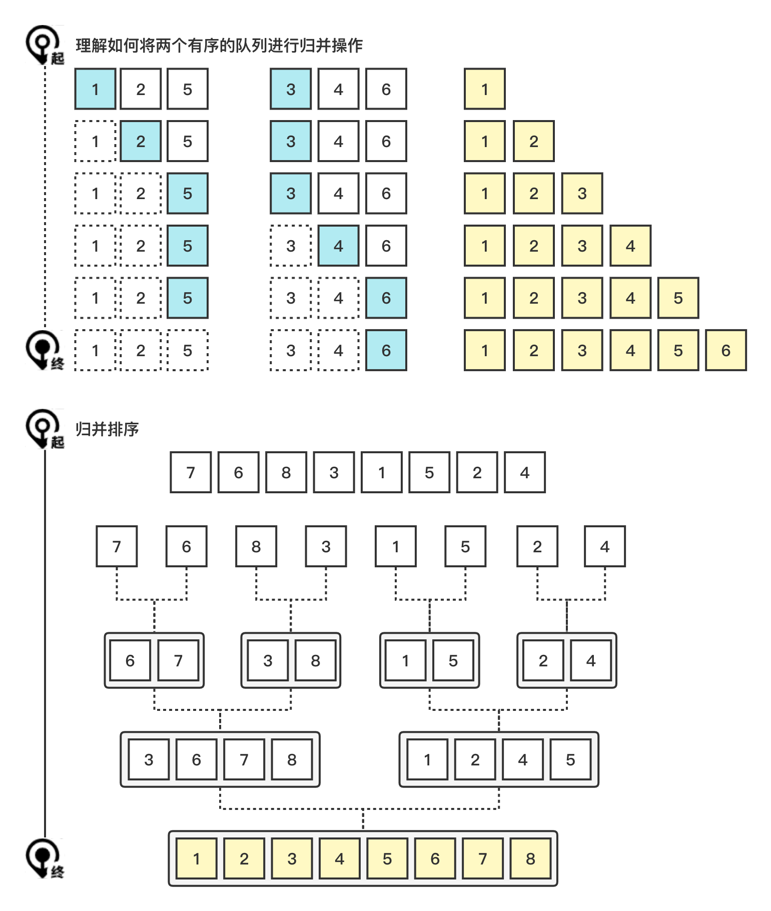

# 归并排序 (Merge Sort)

归并排序 (Merge Sort)，每两个元素划分为一个子序列，并将两个元素比较后排序，形成有序序列，重复将两个有序序列合并，直到合并成一个有序序列。

## 1. 图解流程



### 2. 代码示例

> merge-sort/index.js

 ```js
function sort(arr = []) {
  if (arr.length <= 1) return arr;
  const a = [];

  const i = Math.floor(arr.length / 2);
  const [left, right] = [sort(arr.slice(0, i)), sort(arr.slice(i))];

  while (left.length && right.length) {
    if (left[0] < right[0]) {
      a.push(left.shift());
    } else {
      a.push(right.shift());
    }
  }

  return a.concat(left, right);
}
 ```


### 3. 复杂的分析

| 名称     | En         | 最优     | 平均     | 最坏     | 内存 | 稳定 |
| -------- | ---------- | -------- | -------- | -------- | ---- | ---- |
| 归并排序 | Merge sort | n log(n) | n log(n) | n log(n) | n    | Yes  |

#### 3.1 时间复杂度 (Time Complexity)

#### 3.2 空间复杂度 (Space Complexity)

#### 3.3 稳定性 (Stable)

