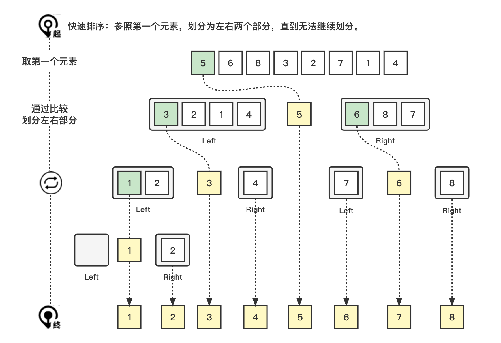

# 快速排序 (Quick Sort)

快速排序 (Quick Sort)。

### 1. 图解流程



### 2. 代码示例

> quick-sort/index.js

``` js
function sort(arr = []) {
  const a = [...arr];

  if (a.length <= 1) return a;

  const left = [];
  const right = [];
  const center = [];

  const centerNumber = a.shift();
  center.push(centerNumber);

  while (a.length) {
    const current = a.shift();
    if (current < centerNumber) {
      left.push(current);
    } else if (current > centerNumber) {
      right.push(current);
    } else {
      center.push(centerNumber);
    }
  }

  return sort(left).concat(center, sort(right));
}
```

### 3. 复杂的分析

| 名称     | En         | 最优     | 平均     | 最坏 | 内存   | 稳定 |
| -------- | ---------- | -------- | -------- | ---- | ------ | ---- |
| 快速排序 | Quick sort | n log(n) | n log(n) | n^2  | log(n) | No   |

#### 3.1 时间复杂度 (Time Complexity)

#### 3.2 空间复杂度 (Space Complexity)

#### 3.3 稳定性 (Stable)

