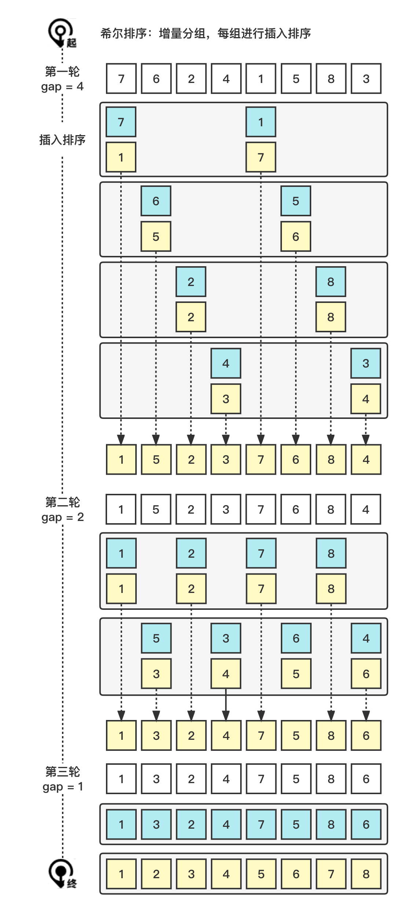

# 希尔排序 (Shell Sort)

希尔排序 (Shell Sort)。

### 1. 图解流程



### 2. 代码示例

> shell-sort/index.js

``` js
function sort(arr = []) {
  const a = [...arr];
  let gap = Math.floor(a.length / 2);
  while (gap > 0) {
    for (let i = gap; i < a.length; i += 1) {
      for (let j = i; j - gap >= 0 && a[j] < a[j - gap]; j -= gap) {
        [a[j], a[j - gap]] = [a[j - gap], a[j]];
      }
    }
    gap = Math.floor(gap / 2);
  }
  return a;
}

```

### 3. 复杂的分析

| 名称     | En         | 最优     | 平均           | 最坏         | 内存 | 稳定 |
| -------- | ---------- | -------- | -------------- | ------------ | ---- | ---- |
| 希尔排序 | Shell sort | n log(n) | 取决于差距序列 | n (log(n))^2 | 1    | No   |
